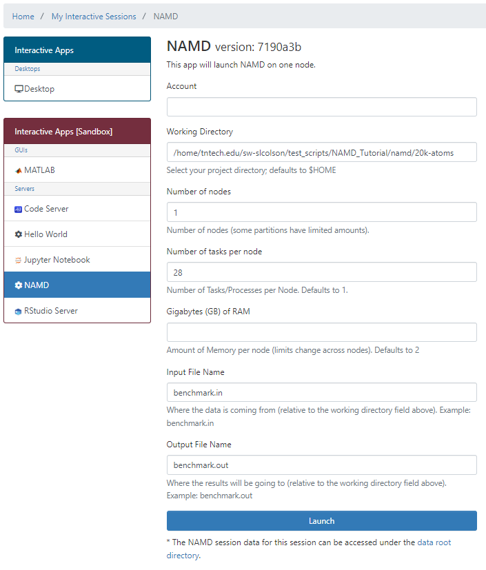
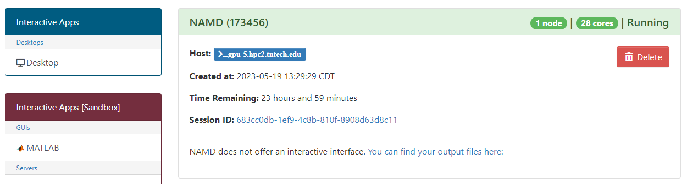

# Batch Connect - Basic NAMD 

A simple example form for Tennessee Tech University's HPC Research Computing and Data Center OnDemand which runs the NAMD molecular dynamics package.

## Prerequisites

[SPACK](https://github.com/spack/spack)

[NAMD](https://github.com/nbcrrolls/namd)

